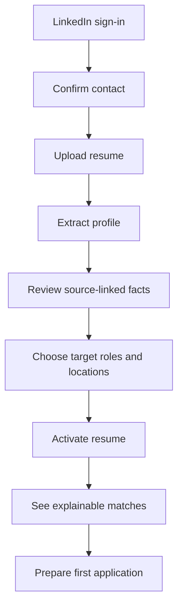
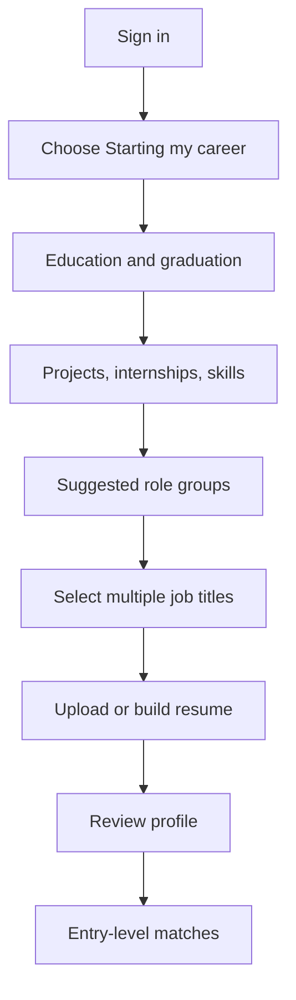
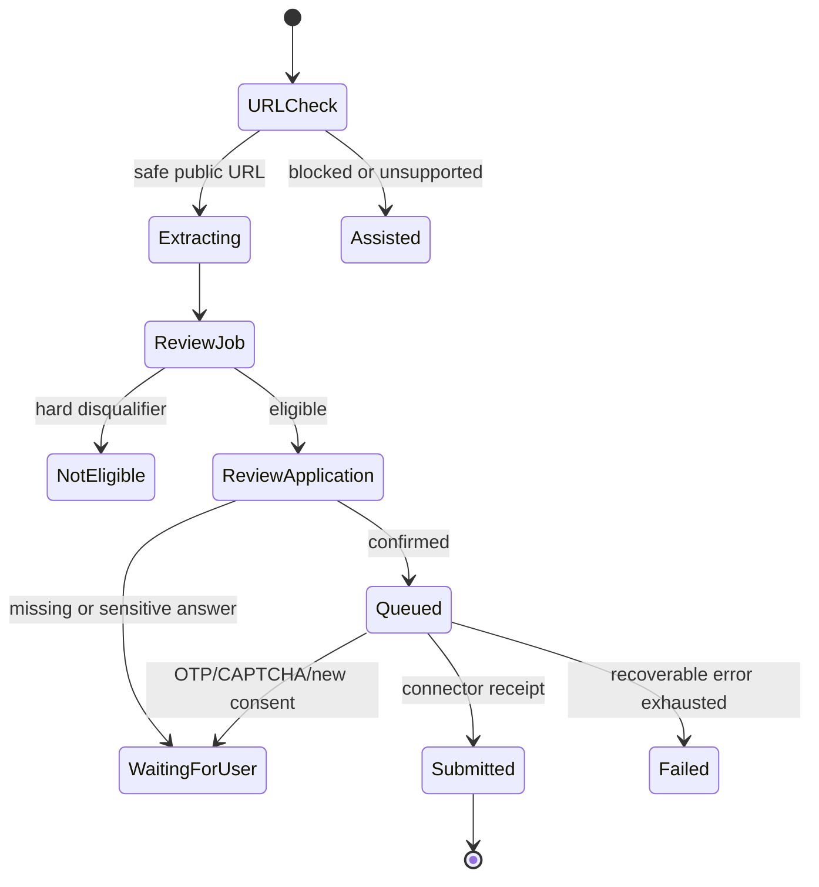

# UX Blueprint

## 1. Experience outcome

The user should always know:

1. Whether their profile is ready.
2. Which jobs are worth considering and why.
3. What will be submitted.
4. Whether ApplyFlow or the user must act next.
5. Whether an application is proven submitted.
6. How much quota remains and when it resets.

The experience is calm, fast, and credible. Avoid “spray and pray,” casino-like counters, fake urgency, confetti for routine actions, and opaque AI scores.

## 2. Information architecture

### User web

- Home
- Discover
  - Search results
  - Saved jobs
  - Import URL
- Applications
  - List
  - Application detail/timeline
- Profile
  - Personal/contact
  - Experience or education/projects
  - Job targets/preferences
  - Saved answers
  - Resumes
- Plan & billing
- Notifications
- Settings
  - Account and sessions
  - Consent and automation
  - Privacy/data export/delete

Desktop uses a collapsible left rail plus top utility bar. Mobile uses four primary tabs: Home, Discover, Applications, Profile. Notifications and account/settings are opened from the top bar/profile.

### Admin web

- Overview
- Customers
- Applications
- Plans & billing
- Connectors & domain policy
- AI control centre
- Reports
- Support cases
- Audit & security
- System settings

Admin is desktop-first but remains functional on tablet. High-risk mutations are intentionally inconvenient on small mobile widths.

## 3. Primary journeys

### 3.1 Experienced candidate activation

Recovery:

- Missing LinkedIn email -> verify email inside ApplyFlow.
- Failed parsing -> keep file, show retry/manual entry.
- Low confidence -> focus review on uncertain fields.
- No suitable matches -> adjust targets or import a URL.

### 3.2 Fresher activation

The role selector groups titles by family, shows “why suggested,” and lets users reject unsuitable suggestions. Do not infer seniority or experience.

### 3.3 Import and apply

### 3.4 Upgrade

1. User opens plan page or quota gate.
2. Selects new plan.
3. Client requests authoritative preview; no client-side monetary calculation.
4. Preview shows old-plan credit, new-plan remaining-period charge, tax, due now, next renewal, and resulting quota.
5. User confirms and completes provider flow if required.
6. UI shows `Payment processing` until webhook/reconciliation confirms.
7. Entitlement and quota update atomically; receipt is available.
8. Failure preserves old plan and quota.

## 4. Onboarding model

Onboarding is resumable. Save after each step and expose progress as steps completed, not an artificial percentage.

| Step | Experienced | Fresher | Required to finish |
| --- | --- | --- | --- |
| Identity/contact | Yes | Yes | Yes |
| Resume upload | First | Later | Yes |
| Experience | Extract/review | Optional internships | One path must be coherent |
| Education/projects | Extract/review | Primary | Education required for fresher path |
| Job titles | Suggest from evidence | Multi-select from education/skills | At least one |
| Locations/work mode | Yes | Yes | At least one location/remote choice |
| Work authorisation | Yes | Yes | Explicit response or unknown-blocking state |
| Resume activation | Yes | Yes | Exactly one active |
| Automation consent | Optional | Optional | Not required for assisted mode |

Users can skip optional questions. Skipped required application facts later create a clear `Action required` state rather than silent assumptions.

## 5. Job match presentation

Do not show one unexplained number alone. Use:

- `Strong fit`, `Potential fit`, `Review carefully`, or `Not eligible` label.
- Evidence sections: role/skills, experience/seniority, location/work mode, authorisation, salary, required credentials.
- Strengths with candidate source links.
- Gaps and unknowns.
- Hard disqualifier banner where applicable.
- AI disclaimer in secondary text: match guidance is based on provided information and may be incomplete.

The numerical score may support sorting but must not be styled as a scientific probability.

## 6. Application review interaction

Review is divided into digestible groups:

1. Job and submission mode.
2. Identity/contact.
3. Resume version.
4. Eligibility and work preferences.
5. Screening answers.
6. Optional cover note.
7. Consent and final action.

Every value shows one of:

- Confirmed by user.
- Extracted from resume and confirmed.
- Newly generated draft—review required.
- Missing—action required.
- Sensitive—direct response required.

Changing a shared profile fact offers:

- Change for this application only.
- Change profile default for future applications.

Never silently overwrite the candidate profile from one application.

## 7. Application status language

| Internal state | User label | Required explanation |
| --- | --- | --- |
| `DRAFT` | Draft | Preparation not complete. |
| `EXTRACTING` | Reading job | Job details are being prepared. |
| `NEEDS_REVIEW` | Review needed | User must verify information. |
| `READY` | Ready to submit | All required fields are confirmed. |
| `QUEUED` | Scheduled | Waiting for an execution slot. |
| `RUNNING` | Submitting | External action is in progress. |
| `WAITING_FOR_USER` | Action required | Show exact action and safe return path. |
| `SUBMITTED_UNVERIFIED` | Submitted—checking | A submit response exists but proof is incomplete. |
| `SUBMITTED` | Applied | Receipt/evidence confirms submission. |
| `FAILED_RETRYABLE` | Delayed | Retry time and cancel option. |
| `FAILED_FINAL` | Could not apply | Cause, quota status, and next option. |
| `WITHDRAWN` | Withdrawn | User-recorded or provider-confirmed. |
| `REJECTED` | Not selected | User/provider recorded. |
| `INTERVIEW` | Interview | User/provider recorded stage. |
| `OFFER` | Offer | User-recorded. |

## 8. Cross-device behaviour

- Drafts and state are server-backed and continue across devices.
- A waiting action can deep-link from email/push to the correct screen.
- Mobile bottom sheets become dialogs/side panels on desktop.
- Desktop application review may use a two-column job/context and form layout; mobile is a single reading column with a sticky safe-area action bar.
- Data tables become prioritised cards on narrow screens; do not force desktop tables horizontally unless comparison is essential.
- External browser transitions clearly show that the user is leaving ApplyFlow and how to return.

## 9. Global screen-state matrix

Every data surface implements these states where applicable:

| State | Behaviour |
| --- | --- |
| Initial loading | Structure-matched skeleton; no fake data. |
| Background refresh | Keep prior data, show subtle updating state. |
| Empty | Explain why and give one primary next action. |
| Partial | Render available content and identify unavailable sections. |
| Stale/offline | Timestamp last data; queue safe drafts; never queue payments/submissions invisibly. |
| Validation error | Inline message plus error summary for long forms; preserve values. |
| Permission denied | Explain role/account limitation without leaking existence of protected data. |
| Quota exhausted | Explain reset date and plan options; keep tracking/manual features usable. |
| Provider pending | Show pending state; do not guess success. |
| Recoverable error | Retry with idempotent command; preserve context. |
| Final error | Plain-language cause, quota impact, support reference, and alternate mode. |

## 10. Content style

- Short sentences, active voice, no blame.
- Prefer `Apply`, `Review`, `Action required`, `Plan`, and `Applications` over backend terms.
- Distinguish `credit`, `refund`, `quota return`, and `payment pending`.
- Never say `guaranteed`, `perfect match`, or `we applied` without evidence.
- Error copy includes what happened, what was preserved, and what the user can do.
- Gen Z tone is direct and contemporary, not slang-heavy or unprofessional.

## 11. Accessibility

- WCAG 2.2 AA target.
- Semantic landmarks and heading hierarchy.
- Complete keyboard operation, logical focus, visible focus, and dialog restoration.
- Minimum 44x44 CSS-pixel touch targets where possible.
- Errors announced and associated with fields.
- Status not conveyed by colour alone.
- Motion respects `prefers-reduced-motion` and native OS settings.
- Charts have data tables/summaries.
- Timer-like OTP/application states do not expire without accessible warning and recovery.
- External-site assisted flow has clear accessible instructions and a manual fallback.

## 12. Analytics events

Do not include resume text, job descriptions, screening answers, contact data, exact salary, or sensitive responses in analytics.

Core events:

- `onboarding_started`, `onboarding_step_completed`, `onboarding_completed`
- `resume_uploaded`, `resume_extraction_reviewed`, `resume_activated`
- `target_added`, `job_search_performed`, `job_imported`, `job_saved`
- `match_viewed`, `hard_disqualifier_seen`
- `application_preparation_started`, `application_review_completed`
- `application_waiting_for_user`, `application_submitted`, `application_failed`
- `quota_gate_seen`, `upgrade_previewed`, `upgrade_confirmed`, `payment_failed`
- `support_opened`, `data_export_requested`, `account_deletion_requested`

Analytics events use pseudonymous user ID and approved enumerations only.
