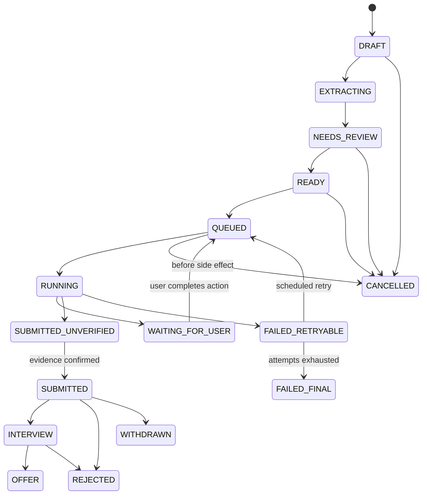
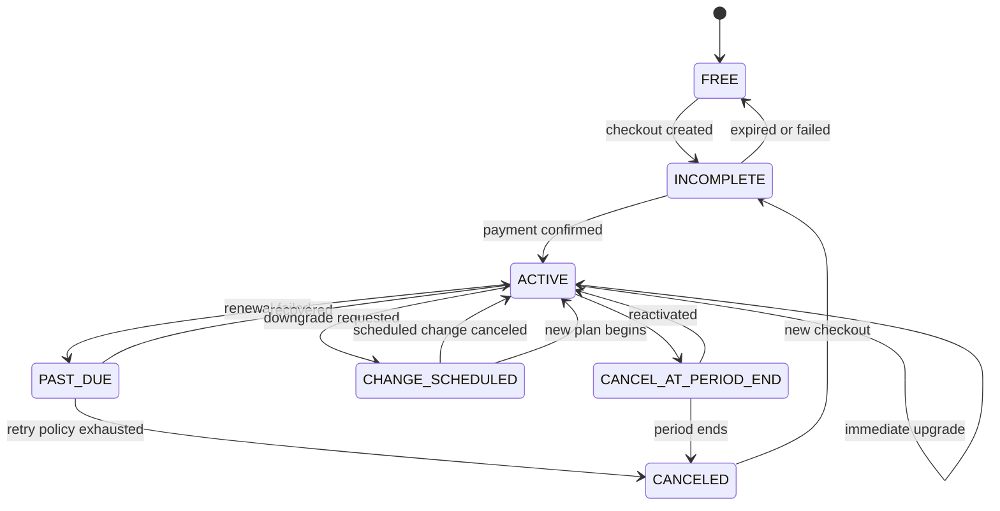

# Data Model, Invariants, and State Machines

## 1. General conventions

- Primary keys: UUIDv7 or another time-sortable UUID generated server-side.
- Store timestamps as UTC `timestamptz`.
- Use ISO country/currency/language codes and IANA time zones.
- Money is integer minor units plus currency.
- Optimistic concurrency uses `version` integer on mutable aggregates.
- Soft deletion only where recovery/legal retention requires it; otherwise explicit delete/anonymise workflow.
- JSONB is reserved for provider snapshots, versioned schemas, and event metadata—not core searchable domain fields.
- PII columns are classified and encrypted where the threat model requires field-level protection.

## 2. Identity and consent

### `users`

`id`, `status`, `primary_email_id`, `locale`, `time_zone`, `onboarding_path`, `onboarding_state`, `created_at`, `last_active_at`, `deleted_at`, `version`.

### `user_identities`

`id`, `user_id`, `provider`, `provider_subject`, `email_claim`, `claim_verified`, `created_at`, `last_used_at`.

Unique: `(provider, provider_subject)`.

### `emails` and `phones`

Normalised value, verification state/timestamps, primary flag, encrypted/display value and hash for uniqueness where appropriate.

### `sessions` / `refresh_token_families`

Device label, token hash, family, assurance level, expiry, rotation/reuse/revocation metadata. Never store raw refresh token.

### `consents`

`id`, `user_id`, `purpose`, `scope_type`, `scope_id`, `copy_version`, `decision`, `granted_at`, `revoked_at`, safe request metadata.

Consent is append-only; revocation creates a new event/state, not an overwritten history.

## 3. Candidate profile

### `candidate_profiles`

`user_id`, `preferred_name`, `legal_name`, `current_location_id`, `availability_date`, `notice_period_days`, `summary`, `profile_version`, timestamps.

### `experiences`

Employer, title, employment type, location, start/end, current flag, description, achievements, source reference, confirmation state, sort order.

### `educations`, `projects`, `certifications`, `candidate_skills`, `languages`

Structured fields plus source/confirmation metadata. Grades/sensitive fields are optional and restricted.

### `job_targets`

Normalised title, custom display title, family, level, internship inclusion, priority, enabled.

### `candidate_preferences`

Locations, remote modes, employment types, salary minimum/target/currency/period, relocation, travel, excluded companies/titles/keywords.

### `work_authorisations`

Country, status enum, sponsorship requirement, expiry if supplied, confirmation time. Never infer.

### `saved_answers`

Question canonical key, answer type, encrypted answer, confirmation/source, sensitivity class, countries/domains where reusable, expiry/review date.

## 4. Documents and resumes

### `documents`

Object key, original name, content hash, detected MIME, size, pages, scan status, extraction status, retention class, owner, timestamps.

### `resumes`

`id`, `user_id`, `name`, `status`, `active_version_id`, `is_active`, timestamps.

Exactly one active resume per active/onboarded user. Enforce with domain transaction and a partial unique database index on `user_id WHERE is_active = true AND status != 'DELETED'`.

### `resume_versions`

`resume_id`, immutable version number, document ID, extracted text reference, extraction schema/prompt/model/run, reviewed profile snapshot ID, created time.

Submitted applications reference `resume_version_id`, never just `resume_id`.

## 5. Jobs and discovery

### `job_sources`

Provider/source type, name, legal/contract reference, configuration reference, capabilities, status.

### `jobs`

Canonical source ID/URL, title/company/location, work mode, employment type, salary range, description/requirements normalised fields, posted/expiry/captured time, status, fingerprint.

### `job_snapshots`

Immutable raw-sanitised/normalised snapshot, schema version, source response hash, capture time. Applications reference snapshot.

### `job_imports` and `search_runs`

User request, safe URL/query, source statuses, result counts, failure classification, expiry. Raw content retention is limited.

### `saved_jobs` / `hidden_jobs`

Unique `(user_id, job_id)` with timestamps/reason.

## 6. Matching

### `match_assessments`

User/profile version, job snapshot, resume version, eligibility result, presentation band/score, evidence/gaps/unknowns, schema/prompt/model/run, generated/expired time.

Hard eligibility rules are stored explicitly and are not overridable by an AI score.

## 7. Applications

### `applications`

`id`, `user_id`, `job_id`, `job_snapshot_id`, `profile_version`, `resume_version_id`, `mode`, `state`, `connector_id/version`, `domain_policy_id/version`, `quota_reservation_id`, `idempotency_key`, `next_action`, `submitted_at`, `evidence_level`, timestamps/version.

Unique active submission attempt rule on `(user_id, canonical_job_id)` with documented reapplication exception.

### `application_answers`

Question stable hash/text snapshot, answer type/value encrypted as needed, sensitivity, source, confirmation state/time, schema version. Immutable after submission; edits create draft revision.

### `application_events`

Append-only timeline: event ID, application, event type, actor type/ID, safe metadata, evidence reference, timestamp.

### `submission_evidence`

Provider receipt ID, final URL, response hash, sanitised screenshot/document reference, evidence level, captured/expiry time. Do not store session cookies or secret headers.

### `connector_runs`

Attempt, operation key, state, policy/connector version, timing, failure category, retry info, trace ID, redacted metrics.

## 8. Connector policy

### `domain_policies`

Domain, approved subdomains, terms URL/review, legal reference, capabilities, modes, geography, limits, consent version, status, owner, review/expiry, kill-switch metadata, immutable policy version.

### `connectors` / `connector_versions`

Type, target source/domain, implementation version, capability set, status, canary percentage, fixture version, health, release/rollback metadata.

### `external_accounts`

User, provider/domain, external account ID, state, auth method, last verified. No password. OAuth tokens only through encrypted token vault/reference when explicitly supported.

## 9. AI control plane

### `ai_providers`

Provider type, display name, base endpoint allowlist, secret reference, enabled/health, organisation/project metadata without secret.

### `ai_task_routes`

Task enum, environment, primary provider/model, prompt version, schema version, fallback route, timeout, attempts, token/cost ceiling, sampling/reasoning config compatible with provider, status.

### `prompt_versions`

Immutable prompt/template, task, schema, version, status, creator/reviewer, eval threshold/results, publish time.

### `ai_runs`

Task, user/resource scoped IDs, route/prompt/model, input/output hashes and redacted metadata, token usage, estimated cost minor units/currency, latency, status/refusal/failure, request ID, retention expiry.

### `ai_eval_cases` / `ai_eval_results`

Fictitious or consented/redacted fixtures, expected assertions, score, regression status.

## 10. Plans, billing, entitlements, quota

### `products`, `plans`, `plan_versions`

Product; plan stable identity; immutable version with currency, price minor units, interval, application quota, feature entitlements, effective dates, visibility, provider mappings.

### `billing_customers`

User, provider, provider customer ID, currency/country, status.

### `subscriptions`

User, plan version, provider/IDs, state, current period, cancel/scheduled change, latest invoice/payment state, version.

### `payment_transactions`, `invoices`, `refunds`

Provider IDs, amount/currency, state, timestamps, reason, reconciliation status. Provider payloads are redacted/versioned.

### `entitlement_periods`

User, plan version, period start/end, limit, status.

### `quota_ledger_entries`

`id`, `user_id`, `entitlement_period_id`, `application_id`, `entry_type`, signed `units`, operation key, reason code, actor, created time.

Entry types: `GRANT`, `RESERVE`, `RELEASE`, `CONSUME`, `REVERSE`, `EXPIRE`, `ADMIN_ADJUSTMENT`, `REFERRAL_GRANT`.

Use signed entries with a documented convention and unique operation key. Never update/delete ledger rows.

### `webhook_events`

Provider, provider event ID, signature verified, received/processed times, state, attempts, payload hash/encrypted reference, error. Unique `(provider, provider_event_id)`.

## 11. Admin, audit, support, notifications

### `admin_users`, `roles`, `permissions`, `admin_role_assignments`

Separate admin subject, status, assurance level, least-privilege roles.

### `audit_events`

Append-only actor, role, action, target, reason, safe before/after summary, request/trace IDs, IP/risk metadata, outcome, time.

### `support_cases` / `support_access_grants`

Case, status, customer, category, notes; JIT data access reason, approver, scope, expiry, revocation.

### `notifications` / `notification_deliveries`

User, category/template/version, safe parameters, channel, state, attempts, provider ID, opened/read timestamps.

## 12. Application state machine

Rules:

- Only server commands perform transitions.
- `RUNNING` lease has owner/expiry; stale leases are recovered safely.
- Cancel after external side effect begins may become a request, not guaranteed cancellation.
- Submission snapshots/answers freeze at `QUEUED`; any changed prerequisite returns to review.
- Quota reservation is acquired on `QUEUED`, consumed on confirmed submission, and released on cancel/final failure. Long `WAITING_FOR_USER` reservations expire by policy with revalidation on resume.

## 13. Subscription state machine

Provider state maps to this canonical model. Unknown provider states fail closed for granting new entitlement and enter reconciliation.

## 14. Connector run state machine

`QUEUED -> LEASED -> POLICY_CHECKED -> PREPARING -> SIDE_EFFECT_PENDING -> SUCCEEDED | WAITING_FOR_USER | RETRYABLE_FAILURE | FINAL_FAILURE | CANCELED`.

No process may cross `SIDE_EFFECT_PENDING` without persisting a unique operation key. Retries use the same key and query provider/evidence before repeating a submit.

## 15. Invariants to enforce in domain and database

- One active resume per user.
- One active entitlement period per user/product/time.
- One payment provider owner per subscription lifecycle.
- No negative available quota; reservation/consumption occurs transactionally.
- No `SUBMITTED` application without evidence level and application event.
- No connector side effect without effective capability, consent, and policy version.
- No plan version mutation after publication.
- No AI prompt version mutation after publication.
- No sensitive saved answer inferred by AI.
- No mutation/deletion of ledger, audit, submitted answer, or application snapshot rows.
- No user can query another user's data; admin access is explicit, authorised, and audited.
