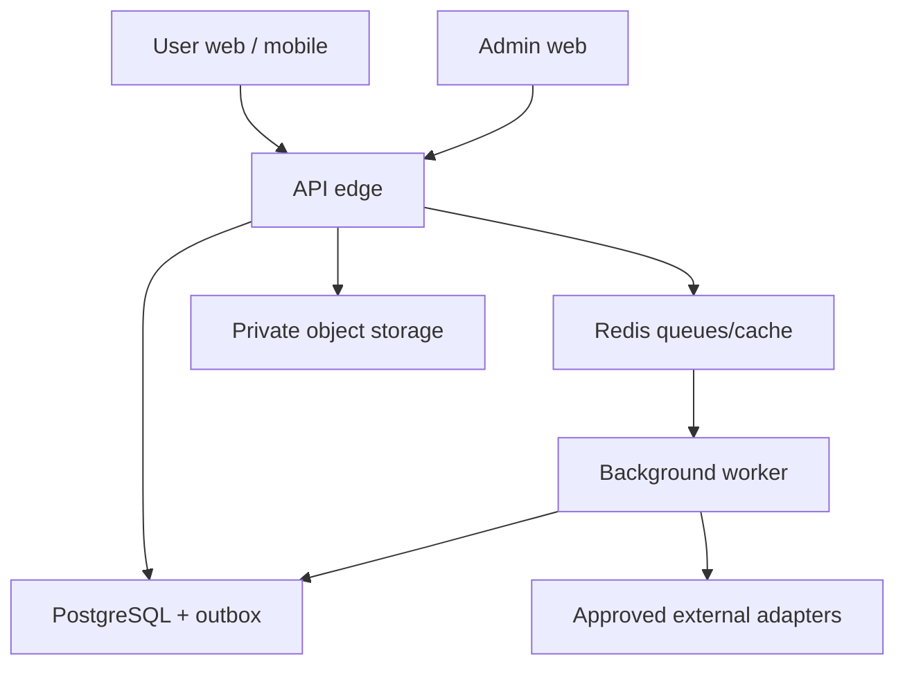
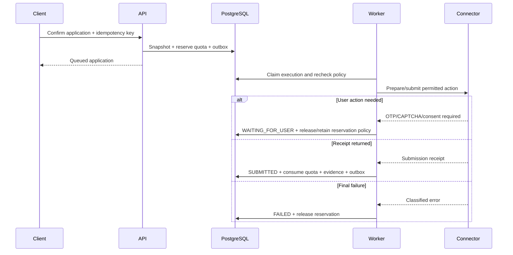

# System Architecture

## 1. Recommended architecture

Use a TypeScript modular monolith for the API plus a separate asynchronous worker. Keep web, admin, and native mobile clients separate, with shared domain schemas and generated API clients. This is the smallest architecture that supports payments, AI, resumable application workflows, browser/API connectors, and admin control without premature microservices.



## 2. Technology decisions

Pin exact stable versions in the lockfile when implementation starts. Do not use floating `latest` in production manifests.

| Area | Choice | Why |
| --- | --- | --- |
| Monorepo | pnpm workspaces + Turborepo | Fast, deterministic TypeScript workspace and scoped pipelines. |
| User web | Next.js App Router + React + TypeScript | Hybrid rendering, mature routing, accessibility ecosystem. |
| Admin web | Separate Next.js app | Stronger deployment/RBAC boundary and smaller user bundle. |
| Mobile | Expo React Native + Expo Router | One iOS/Android codebase, system-browser OAuth, practical demo workflow. |
| API | NestJS with Fastify adapter | Modular DI, OpenAPI, guards/interceptors, testable adapters. |
| Worker | NestJS standalone application + BullMQ | Shared domain/config with isolated asynchronous execution. |
| Validation | Zod at all external boundaries | Runtime truth shared by clients, API, AI, and provider adapters. |
| Database | PostgreSQL + Prisma | Transactions, constraints, JSONB where justified, migrations, typed access. |
| Queue/cache | Redis + BullMQ | Retries, scheduled tasks, locks, rate/concurrency coordination. |
| Object storage | S3-compatible API; MinIO locally | Private resumable file storage without cloud lock-in. |
| Web UI | Tailwind CSS + Radix primitives/shadcn-derived owned components | Token-driven accessible components with local ownership. |
| Data fetching | TanStack Query; server loaders where appropriate | Clear server/cache state and invalidation. |
| Forms | React Hook Form + Zod | Accessible, performant typed forms. |
| Mobile secure storage | Expo SecureStore | Refresh token protection by OS facilities. |
| Testing | Vitest, Testing Library, Supertest, Playwright, Maestro | Unit through web/native end-to-end coverage. |
| Observability | OpenTelemetry + structured logs; Sentry-compatible error adapter | Vendor-neutral traces/metrics with optional hosted error reporting. |
| Local environment | Docker Compose | Deterministic PostgreSQL, Redis, MinIO, Mailpit, and provider simulators. |

## 3. Capability modules

The API and domain are organised by product capability:

- Identity and sessions.
- Candidate profile and onboarding.
- Documents/resumes.
- Job catalogue, discovery, and import.
- Matching and eligibility.
- Applications and application answers.
- Connector policy and execution.
- AI control plane and AI runs.
- Plans, billing, entitlements, and quota ledger.
- Notifications.
- Admin/support.
- Reporting/analytics.
- Audit, privacy, and security.

Each module exposes commands, queries, events, and public types. Modules do not reach into another module's repositories; use an explicit service/port or event.

## 4. Dependency direction

```text
apps/web, apps/admin, apps/mobile
    -> packages/api-client, packages/schemas, packages/design-tokens

apps/api, apps/worker
    -> packages/domain
    -> packages/db, packages/auth, packages/ai, packages/billing,
       packages/connectors, packages/storage, packages/observability

packages/domain
    -> no framework or provider SDK
```

Enforce with ESLint import-boundary rules and dependency-cruiser/madge CI checks.

## 5. Rendering and state ownership

### User web

- Public/auth pages: server-rendered where useful.
- Authenticated app shell: server verifies session; feature data uses server preload plus TanStack Query hydration or client queries as appropriate.
- Shareable discover/application list filters live in URL search parameters.
- Draft form state uses React Hook Form and server-side draft endpoints.
- No access/refresh token in localStorage.

### Admin web

- Server-verified admin session and permission on each route/action.
- Data-dense pages use cursor pagination and URL state.
- Privileged actions require fresh-auth/JIT token where specified.

### Mobile

- Access token held in memory; rotating opaque refresh token in SecureStore.
- TanStack Query for server state and persisted non-sensitive cache metadata.
- Offline supports reading cached non-sensitive summaries and saving local form drafts. It never silently queues payments or submissions.

## 6. Authentication and session architecture

### LinkedIn OIDC

- API owns authorisation-code + PKCE flow.
- Generate and verify `state`, `nonce`, PKCE verifier/challenge.
- Validate JWT signature with LinkedIn JWKS plus issuer, audience, expiry, and nonce.
- Store stable provider subject, not profile URL, as identity key.
- Email is optional and must be separately verified if absent/unverified.
- OIDC claims populate proposed profile values; user remains authoritative.

### Sessions

- Web: secure, HttpOnly, `SameSite=Lax` session cookie scoped appropriately; CSRF protections for mutations.
- Mobile: short-lived signed access token plus one-time rotating opaque refresh token stored hashed server-side.
- Refresh-token reuse revokes the token family and raises security event.
- Session/device page supports revocation.
- Admin identity is logically separate, with MFA-ready assurance level and stricter expiry.

### Local/demo auth

Local adapter exposes seeded personas only in non-production environment. Production build fails if demo auth is enabled.

## 7. Command, transaction, and event pattern

For a state-changing command:

1. Authenticate and authorise.
2. Validate request and idempotency key.
3. Load required aggregate/version.
4. Execute domain rule.
5. In one PostgreSQL transaction, save state, append audit/ledger rows, and append outbox event.
6. Return stable command result.
7. Outbox relay publishes to BullMQ.
8. Worker handles side effects idempotently and writes result via another command/transaction.

At-least-once delivery is assumed. Consumers deduplicate by event ID and operation key.

## 8. Application execution flow



Immediately before the external side effect, the worker rechecks user consent, effective domain policy, connector health, quota reservation, job expiry, and kill switches.

## 9. Connector sandbox

Browser/API connectors run in a worker deployment separate from the API:

- Dedicated low-privilege service identity.
- Egress allowlist per connector/domain.
- Ephemeral browser context and storage.
- No access to payment/AI secrets outside required scoped references.
- CPU/memory/time limits and concurrency caps.
- Download disabled unless explicitly needed and scanned.
- Screenshots/evidence sanitised and retention-limited.
- No stealth plugins, proxy rotation for bypass, CAPTCHA solving, or fingerprint evasion.

For stronger production isolation, move browser execution to short-lived containers/jobs while preserving the same connector port.

## 10. AI architecture

- AI is behind a server-side task gateway; clients never call model providers.
- Task routes reference provider, model string, prompt version, schema version, timeout, retry, cost ceiling, and fallback.
- Provider secrets are write-only from admin and resolved by secret reference.
- Structured extraction output is schema validated, then deterministic business validation runs.
- AI cannot execute connector or billing commands.
- Store prompts by immutable version; store minimal redacted request metadata and output fields according to retention policy.
- Use eval cases before publishing prompt/model changes.

See `docs/04-api/AI_GATEWAY.md`.

## 11. Billing and entitlement architecture

- Provider webhooks and reconciliation are authoritative for money state.
- ApplyFlow's subscription/entitlement tables are authoritative for product access.
- Never grant paid quota solely from a client redirect.
- Store all money in integer minor units plus ISO currency.
- Published plan versions are immutable and map to provider price/plan IDs.
- Quota is an append-only ledger with grant, reserve, release, consume, reverse, expire, and admin adjustment entries.
- Concurrency uses database row/version locking; available quota is calculated/maintained transactionally.

See `docs/05-billing/SUBSCRIPTIONS_QUOTAS.md`.

## 12. Search

MVP uses PostgreSQL full-text search plus `pg_trgm` indexes for jobs and applications. Add a separate search service only when measured volume/latency/relevance requires it.

- Canonical normalised search fields avoid searching raw sensitive answers.
- User data is always scoped by `user_id` in the server query.
- Cursor pagination for stable large lists; offset acceptable for small admin reports only where documented.

## 13. File pipeline

1. API creates short-lived upload intent for an allowed MIME/size.
2. Client uploads to private quarantine prefix.
3. Worker verifies magic bytes, hashes file, virus scans, and checks page/zip-bomb limits.
4. Clean object is moved to protected prefix and document record updated.
5. Deterministic PDF/DOCX extraction runs; OCR only when needed.
6. AI extraction receives bounded text with prompt-injection guard.
7. User reviews proposed fields.

Original documents, derived text, and extracted structured data have separate retention/deletion handling.

## 14. Caching

- No caching of authorisation decisions beyond short, safely invalidated request scope.
- Redis may cache public job results, connector health, rate-limit counters, and ephemeral OIDC state.
- Candidate/application private responses default to `private, no-store` unless a specific safe cache policy exists.
- Cache keys include schema/version and tenant/user boundary where relevant.

## 15. Reliability

- Timeouts on every external call.
- Exponential backoff with jitter for classified retryable errors.
- Circuit breaker per provider/connector.
- Dead-letter queue with admin inspection and safe replay.
- Payment and submission retries are idempotent and provider-aware.
- Reconciliation jobs compare provider subscription/payment state to local projections.
- PostgreSQL point-in-time recovery and routine restore drills.
- Kill switches do not depend on deploying new code.

## 16. Deployment topology

### Local/demo

Docker Compose services:

- PostgreSQL
- Redis
- MinIO
- Mailpit
- API
- Worker
- User web
- Admin web
- Mock external provider server

Expo mobile runs locally against the API using documented device/emulator host configuration.

### Production-shaped

- Managed PostgreSQL and Redis.
- Private object storage with lifecycle policies.
- Separate web, admin, API, general worker, and browser-worker deployments.
- CDN/WAF in front of public web/API.
- Secret manager/KMS.
- Central logs, traces, metrics, error reporting, and alerting.
- Region selection based on target users and data/legal review.

All services build as OCI containers. Include Railway-compatible deployment descriptors for demo/staging if chosen, but keep cloud primitives portable.

## 17. Scale triggers

Do not split services until one of these is measured:

- Browser connectors require independent security/network isolation beyond deployment boundaries.
- Worker throughput or queue latency cannot meet SLO through horizontal scaling.
- Billing requires stricter ownership/deployment controls.
- Job catalogue/search volume exceeds PostgreSQL targets.
- Separate teams need independent release ownership and stable contracts.

The first likely extraction is browser execution, not core profile or application domain logic.
